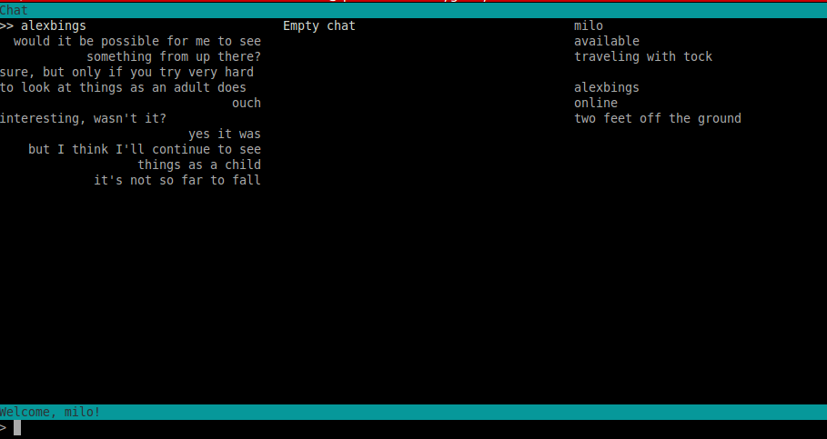

# gchat 

a quick chat client modelled after gchat, made for my friends



## Installation

Tested on Ubuntu 14.04 and OSX:
```bash
  git clone https://github.com/juesato/gchat
  sudo pip install urwid
  sudo pip install socketIO-client
```

To run:
```
  cd gchat/client
  python client.py
```

## Things you should know

The UI is pretty raw. You need to type some commands to do things.

* `\friend username` to add `username` as a contact
* `\chat username` to start a chat with `username`
* `\status asdf asdf asdf` to set your status
* ctrl + c to logout

Re: security - there's no security implemented whatsoever. I promise not to look at your chats! Incidentally, they'll also be deleted at least once a day (i.e. after that chat hasn't been used for some period of time). Also, passwords are communicated directly over plaintext and not hidden while you type them.

## Contributing

Chat me if you want to change something! The code is straight spaghetti but also ~1000 lines so still really easy to change.

## About

I just wrote this for fun and probably won't work on it any more. That said, there were a number of things I liked about Gchat (asides from "only way to chat your friends" + nostalgia) that I wish were in a chat client today:

* Everyone on your friend list was actually a friend and not just an acquaintance (you had to know their handle). Ideally, I'd like for any friend you don't talk to for a few months to be removed from your friend list, so that friend lists are kept small.
* Statuses are persistent. It's easy to share what you're thinking about or feeling without broadcasting it to the whole world, but in a way that it's still easy for your friends to see. And the only way to respond to statuses is with a conversation, rather than a 'like' or token comment.
* No mobile. Being able to message people quickly is great for logistics, but trying to chat people on a phone is stressful and distracting for me. I'd prefer to have a longer conversation when I'm free on my computer (and thus to get notifications once I'm on my computer, rather than on my phone instantly).

Sorry for the terminal-based UI - it would have been cool to integrate with Gmail, but I don't know how to do that, and also, I really didn't want to deal with CSS.
